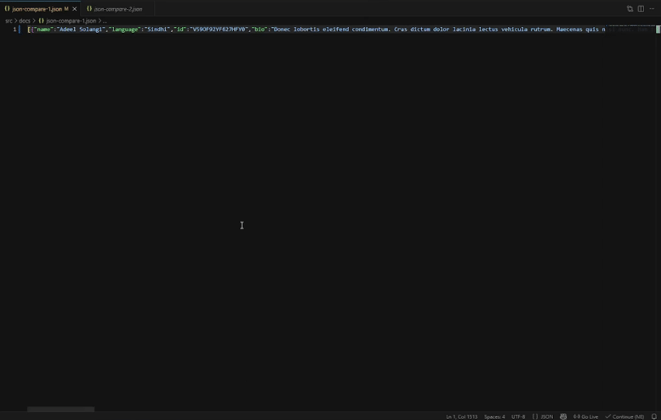
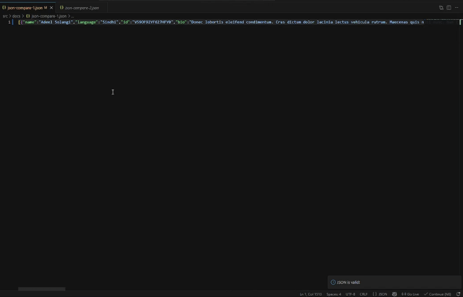
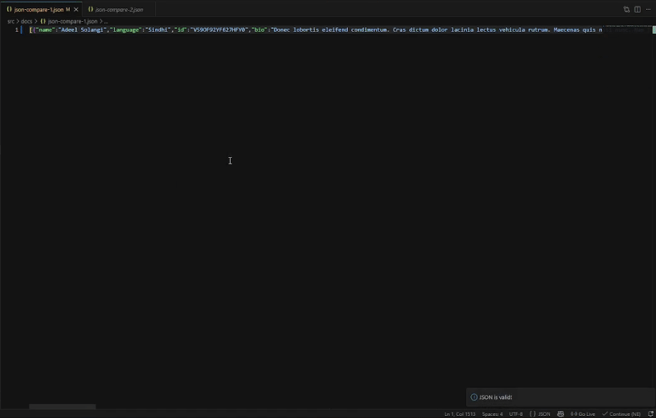

# JSON Powerhouse

> **Fix broken JSON and generate production-ready types — instantly, inside VS Code.**

[](https://marketplace.visualstudio.com/items?itemName=arjayabalan.json-powerhouse-vscode)
[](https://marketplace.visualstudio.com/items?itemName=arjayabalan.json-powerhouse-vscode)
[](https://opensource.org/licenses/MIT)
[](https://code.visualstudio.com/)

Paste messy, broken, or invalid JSON → get clean JSON and ready-to-use types in one command. No copy-pasting to online tools. No manual cleanup. No scripts. Everything runs offline inside your editor.

---

## 📸 Demo








---

## ✨ Features

- **Auto-fix broken JSON** — handles missing quotes, trailing commas, single quotes, unquoted keys, and more
- **Format & prettify** — clean, consistent output every time
- **Generate types instantly** — TypeScript, C#, Go, Java, Python, and more
- **Real-time validation** — catch errors as you type
- **100% offline** — nothing leaves your machine

---

## 🚀 Installation

1. Open VS Code
2. Go to the **Extensions** panel (`Ctrl+Shift+X` / `Cmd+Shift+X`)
3. Search for **JSON Powerhouse**
4. Click **Install**

Or install directly from the [VS Code Marketplace](https://marketplace.visualstudio.com/items?itemName=arjayabalan.json-powerhouse-vscode).

---

## ⚡ Quick Start

Paste this broken JSON into any `.json` file:

```json
{'user_id': 1, name: "John",}
```

Run `JSON Powerhouse: Fix & Format JSON` — you get:

```json
{
  "user_id": 1,
  "name": "John"
}
```

Then run `JSON Powerhouse: Generate TypeScript` — you get:

```ts
interface RootObject {
  userId: number;
  name: string;
}
```

Done. Two commands. Zero cleanup.

---

## ⌨️ Commands

Open the Command Palette (`Ctrl+Shift+P` / `Cmd+Shift+P`) and type **JSON Powerhouse**:

| Command | Description |
|---|---|
| `JSON Powerhouse: Fix & Format JSON` | Auto-fix and prettify invalid JSON |
| `JSON Powerhouse: Validate JSON` | Check JSON for errors in real time |
| `JSON Powerhouse: Generate TypeScript` | Generate a TypeScript interface |
| `JSON Powerhouse: Generate C#` | Generate a C# class |
| `JSON Powerhouse: Generate Go` | Generate a Go struct |
| `JSON Powerhouse: Generate Java` | Generate a Java class |
| `JSON Powerhouse: Generate Python` | Generate a Python dataclass |

> Keyboard shortcuts can be customised in **File → Preferences → Keyboard Shortcuts**.

---

## ⚙️ Configuration

Open **Settings** (`Ctrl+,`) and search for `jsonPowerhouse`:

| Setting | Options | Default |
|---|---|---|
| `jsonPowerhouse.indentation` | `2`, `4`, `tab` | `2` |
| `jsonPowerhouse.sortKeys` | `none`, `asc`, `desc` | `none` |
| `jsonPowerhouse.quoteStyle` | `double`, `single` | `double` |
| `jsonPowerhouse.trailingCommas` | `true`, `false` | `false` |
| `jsonPowerhouse.validateOnSave` | `true`, `false` | `true` |

---

## 🧠 Built for real-world JSON

Most JSON tools assume your data is valid. Real API responses rarely are.

JSON Powerhouse is designed for the messy, inconsistent payloads that show up in actual development — broken logs, partial responses, copy-pasted output from terminals, third-party APIs with inconsistent formatting. It fixes what it finds and generates types from what remains.

**Common scenarios where it helps:**

- Integrating a new backend and need types fast
- Debugging a broken API response in production
- Working with legacy data that nobody cleaned up
- Switching between languages and needing type stubs quickly

---

## 📋 Requirements

- Visual Studio Code **1.80 or later**

---

## 🤝 Contributing & Support

Found a bug or have a feature request?
Open an issue on [GitHub](https://github.com/1-arjayabalan-0/json-powerhouse).

Pull requests are welcome.

---

## 📝 License

[MIT](LICENSE) © 2024 Arjayabalan